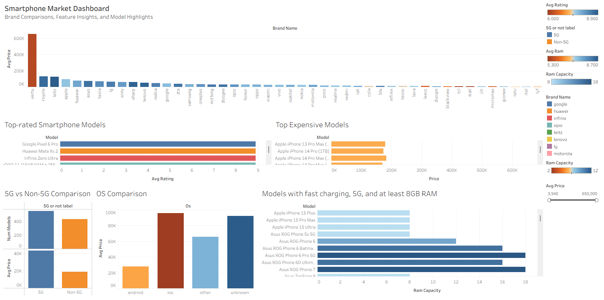

# Smartphones-Market-Analysis

This project explores smartphone market trends using **Python**, **SQL**, and **Tableau**. It covers brand comparisons, feature breakdowns, top-performing models, and premium picks based on specs like 5G support, RAM, and fast charging.

This project uses the [Real World Smartphones Dataset on Kaggle](https://www.kaggle.com/datasets/abhijitdahatonde/real-world-smartphones-dataset) published by Abhijit Dahatonde on Kaggle.
The dataset includes specifications for over 1,000 smartphone models, covering:

- Brand, model, and operating system

- Price, RAM, battery capacity, and processor speed

- Features like 5G support and fast charging

- User ratings and other performance indicators

---

## Tools Used

- **Python**: Data cleaning, missing value handling, and CSV export
- **SQL**: Exploratory analysis, segmentation, and feature-based filtering
- **Tableau**: Interactive dashboard with modular visualizations

---

## Python Data Cleaning

The full cleaning process is in [`python/data_cleaning.ipynb`](python/data_cleaning.ipynb).

It includes:

- Dropping duplicates  
- Handling missing values   
- Exporting cleaned CSV for SQL and Tableau

Key Python Cleaning Steps:

```python
import pandas as pd

# Load dataset
df = pd.read_csv("smartphones.csv")

# Drop duplicate rows
df.drop_duplicates(inplace=True)

# Replace empty strings with NaN
df.replace("", pd.NA, inplace=True)

# Fill missing categorical values
df["processor_brand"].fillna("unknown", inplace=True)
df["os"].fillna("unknown", inplace=True)

# Export cleaned dataset
df.to_csv("cleaned_smartphones.csv", index=False)

```
---

## SQL Data Exploration & Analysis

The cleaned dataset was imported into PostgreSQL for SQL exploration and analysis.  
Full SQL script: [`sql/data_exploration.sql`](sql/data_exploration.sql)

### Key Questions Explored

- How many smartphone models and brands are in the dataset?
- What brands have the highest average price & rating?
- Do 5G phones cost significantly more than non-5G phones?
- How do RAM, battery capacity, and processor speed correlate with price?
- Which models offer the best specifications vs price?

### Sample Queries

#### Count unique brands, OS types, and processor brands
```sql
SELECT COUNT(DISTINCT brand_name) AS unique_brands, 
       COUNT(DISTINCT os) AS unique_os_types,
       COUNT(DISTINCT processor_brand) AS unique_processors
FROM smartphones;
```

#### Compare 5G vs non-5G models
```sql
SELECT "5G_or_not",
       COUNT(*) AS num_models,
       ROUND(AVG(price)::numeric, 2) AS avg_price
FROM smartphones
GROUP BY "5G_or_not";
```
#### Underperforming models (low rating with high price)
```sql
SELECT model, brand_name, price, avg_rating
FROM smartphones
WHERE avg_rating < 7.0 AND price > 30000
ORDER BY price DESC;
```

---

## Tableau Visualization

The cleaned smartphone dataset was visualized in Tableau to analyze brand positioning, pricing strategies, and performance features.

### Tableau Files
- Tableau Workbook: [`tableau/visualization.twb`](tableau/visualization.twb)
- Screenshots folder: [`tableau/screenshots`](tableau/screenshots)

---

### Interactive Dashboard

Explore the full interactive dashboard on Tableau Public:

🔗 **https://public.tableau.com/views/visualization_17622916367950/SmartphoneInsights**

[](https://public.tableau.com/views/visualization_17622916367950/SmartphoneInsights)

---

### Smartphone Market Overview Dashboard


This dashboard provides a comprehensive view of the smartphone market using data-driven visualizations. It combines brand-level comparisons, feature breakdowns, and model highlights to uncover trends in pricing, performance, and user ratings.

**Key Highlights**

- Brand Distribution: Explore how major brands like Apple, Samsung, Xiaomi, and others position themselves across pricing tiers and performance metrics.

- Model Insights: Identify top-rated and most expensive smartphones based on user reviews and pricing data.

- Feature Comparisons: Analyze the impact of 5G support and operating systems on average specs and market presence.

- Premium Picks: Filter models that meet criteria such as fast charging, 5G capability, and ≥8GB RAM.
  
---

### 5G vs Non-5G & OS Comparison


**Two bar charts comparing:**
- 5G vs Non-5G Models: Count and average price
- Operating Systems: Android, iOS, Other, Unknown

**Highlights:**
- 5G models outnumber non-5G and have higher average prices
- iOS models show the highest average price, followed by unknown OS types

---

### High-Performing Models


**Horizontal bar chart showing models that meet all three criteria:**
- 5G support
- Fast charging available
- At least 8GB RAM

**Highlights**
- Asus ROG series lead with up to 18GB RAM
- Google Pixel and Honor models also meet the criteria
- Apple models appear but fall short on RAM threshold


---


